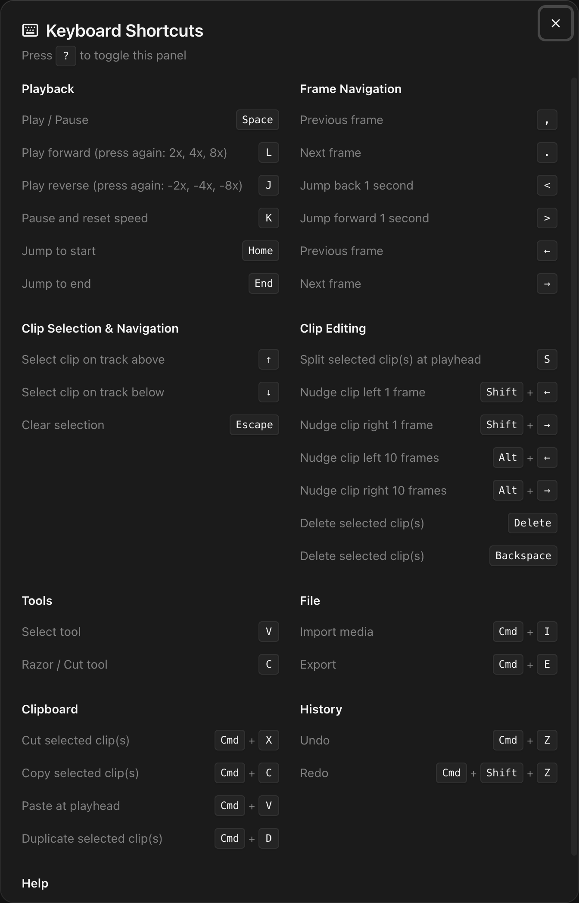

Press <kbd>?</kbd> at any time to open the keyboard shortcuts modal inside the editor.

## Playback

| Shortcut         | Action                                    |
| ---------------- | ----------------------------------------- |
| <kbd>Space</kbd> | Play / Pause                              |
| <kbd>L</kbd>     | Play forward (press again: 2x, 4x, 8x)    |
| <kbd>J</kbd>     | Play reverse (press again: -2x, -4x, -8x) |
| <kbd>K</kbd>     | Pause and reset speed                     |
| <kbd>Home</kbd>  | Jump to start                             |
| <kbd>End</kbd>   | Jump to end                               |

## Frame Navigation

| Shortcut         | Action                |
| ---------------- | --------------------- |
| <kbd>,</kbd>     | Previous frame        |
| <kbd>.</kbd>     | Next frame            |
| <kbd>{'<'}</kbd> | Jump back 1 second    |
| <kbd>{'>'}</kbd> | Jump forward 1 second |
| <kbd>←</kbd>     | Previous frame        |
| <kbd>→</kbd>     | Next frame            |

## Clip Selection & Navigation

| Shortcut          | Action                     |
| ----------------- | -------------------------- |
| <kbd>↑</kbd>      | Select clip on track above |
| <kbd>↓</kbd>      | Select clip on track below |
| <kbd>Escape</kbd> | Clear selection            |

## Clip Editing

| Shortcut                        | Action                             |
| ------------------------------- | ---------------------------------- |
| <kbd>S</kbd>                    | Split selected clip(s) at playhead |
| <kbd>Shift</kbd> + <kbd>←</kbd> | Nudge clip left 1 frame            |
| <kbd>Shift</kbd> + <kbd>→</kbd> | Nudge clip right 1 frame           |
| <kbd>Alt</kbd> + <kbd>←</kbd>   | Nudge clip left 10 frames          |
| <kbd>Alt</kbd> + <kbd>→</kbd>   | Nudge clip right 10 frames         |
| <kbd>Delete</kbd>               | Delete selected clip(s)            |
| <kbd>Backspace</kbd>            | Delete selected clip(s)            |

## Tools

| Shortcut     | Action           |
| ------------ | ---------------- |
| <kbd>V</kbd> | Select tool      |
| <kbd>C</kbd> | Razor / Cut tool |

## File

| Shortcut      | Action       |
| ------------- | ------------ |
| <kbd>⌘I</kbd> | Import media |
| <kbd>⌘E</kbd> | Export       |

## Clipboard

| Shortcut      | Action                     |
| ------------- | -------------------------- |
| <kbd>⌘X</kbd> | Cut selected clip(s)       |
| <kbd>⌘C</kbd> | Copy selected clip(s)      |
| <kbd>⌘V</kbd> | Paste at playhead          |
| <kbd>⌘D</kbd> | Duplicate selected clip(s) |

## History

| Shortcut       | Action |
| -------------- | ------ |
| <kbd>⌘Z</kbd>  | Undo   |
| <kbd>⌘⇧Z</kbd> | Redo   |

## Help

| Shortcut     | Action                  |
| ------------ | ----------------------- |
| <kbd>?</kbd> | Show keyboard shortcuts |

On Windows and Linux, replace <kbd>⌘</kbd> with <kbd>Ctrl</kbd>.
