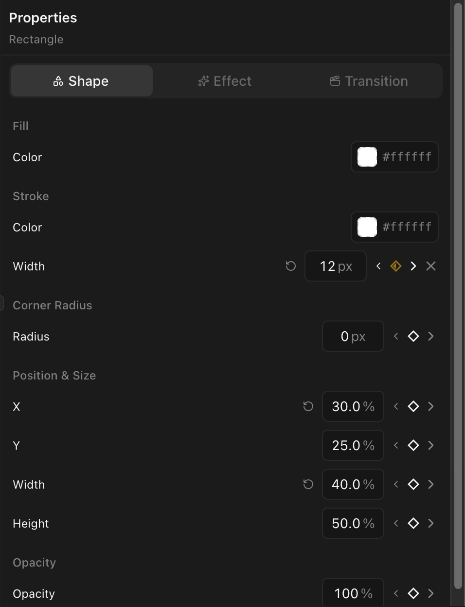
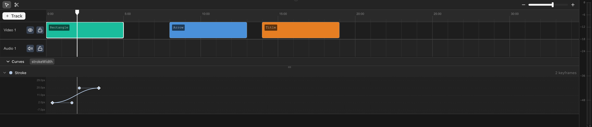

Pin a value at one time, a different value at another — Tooscut interpolates between them.

## The keyframe button

Every animatable property has a diamond button next to it in the properties panel.

Three states:

| State           | Meaning                                         |
| --------------- | ----------------------------------------------- |
| **Empty**       | No keyframes exist for this property            |
| **Half-filled** | Keyframes exist, but the playhead is not at one |
| **Filled**      | The playhead is at a keyframe                   |

## Adding a keyframe

1. Move the playhead to the time where you want the keyframe.
2. Click the keyframe diamond button, or simply change the property value — a keyframe is created automatically.

## Removing a keyframe

Move the playhead to the exact time of a keyframe (the diamond shows filled) and click the button to remove it.

## Navigating between keyframes

The previous/next arrows beside the diamond jump the playhead to the nearest keyframe in either direction.

## Animatable properties

### Transform

Position (x, y), scale (scaleX, scaleY), rotation

### Visual

Opacity, corner radius

### Effects

Brightness, contrast, saturation, hue rotate, blur

### Audio

Volume

### Shape and line

Width, height, stroke width, corner radius, line endpoints (x1, y1, x2, y2)

### Color grading

Over 40 properties across CDL, color wheels, curves, qualifier, and power window nodes. See [Color Grading](/docs/color-grading/color-grading-overview).

## The curve editor

When a clip has keyframed properties, a **Curves** toggle appears at the bottom of the timeline. Click it to open the graph editor.

The curve editor shows each keyframed property as a line plotted over time. You can:

- **Drag keyframe points** up or down to change their value, or left and right to change their timing.
- **See all animated properties at once** — each property is drawn in a different color with its name shown in the toolbar.

See [Easing and Curves](/docs/animation/easing-and-curves) for details on controlling the interpolation between keyframes.
