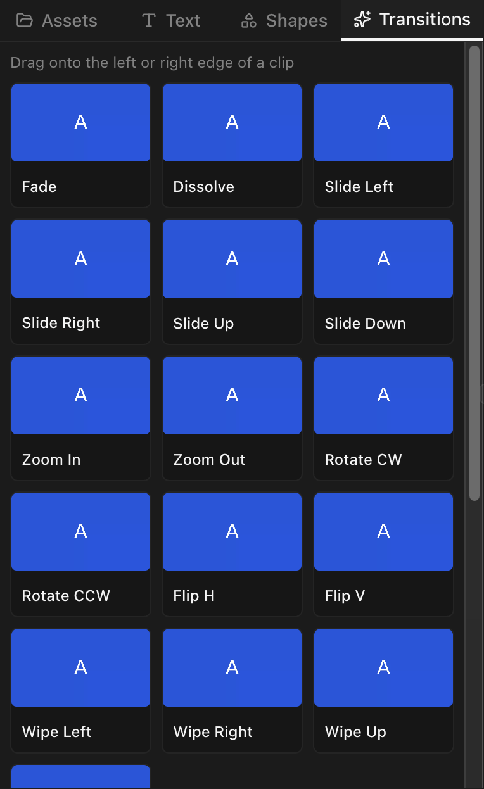
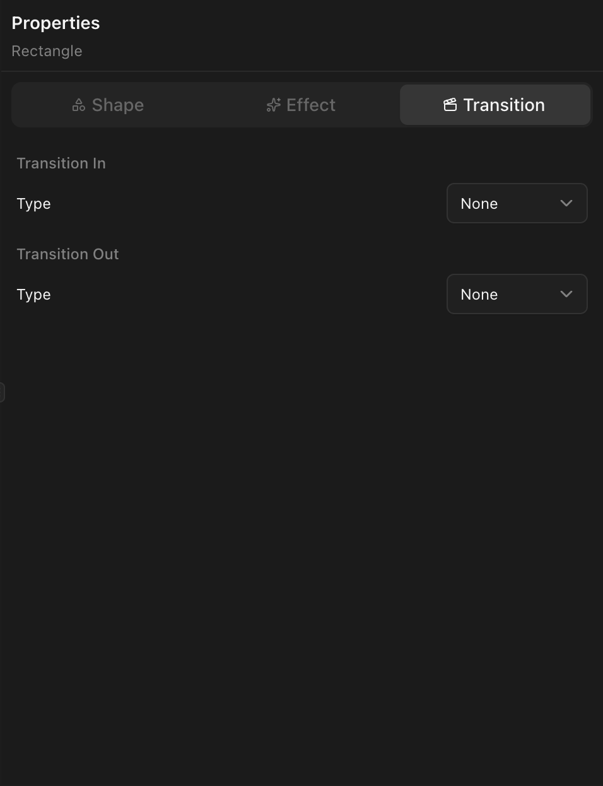

## Clip transitions

Applied to the beginning (in) or end (out) of a single clip.

### Available types

| Category     | Types                                         |
| ------------ | --------------------------------------------- |
| **Fade**     | Fade                                          |
| **Dissolve** | Dissolve                                      |
| **Wipe**     | Wipe Left, Wipe Right, Wipe Up, Wipe Down     |
| **Slide**    | Slide Left, Slide Right, Slide Up, Slide Down |
| **Zoom**     | Zoom In, Zoom Out                             |
| **Rotate**   | Rotate Clockwise, Rotate Counter-Clockwise    |
| **Flip**     | Flip Horizontal, Flip Vertical                |

### Applying a clip transition

Drag a transition from the panel onto the start or end of a clip.

### Transition settings

- **Duration** — 0.1 to 3 seconds.
- **Easing** — Linear, Ease In, Ease Out, or Ease In Out.

## Cross transitions

Blend between two adjacent clips on the same track.

### Available cross transition types

| Type       |
| ---------- |
| Dissolve   |
| Fade       |
| Wipe Left  |
| Wipe Right |
| Wipe Up    |
| Wipe Down  |

### Creating a cross transition

The outgoing and incoming clips must be adjacent (or overlapping) on the same track. Select the overlap region or use the transition panel to apply.

### Cross transition settings

- **Duration** — Overlap length.
- **Easing** — Blend curve acceleration.
