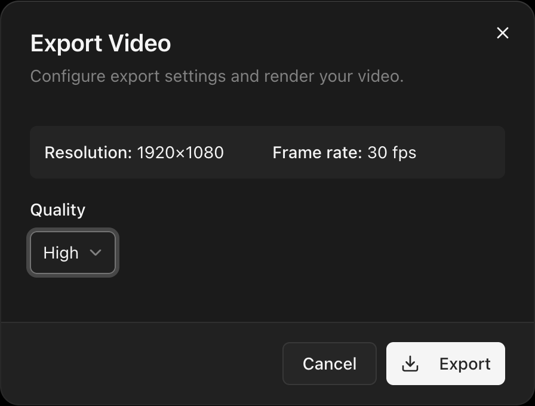

<kbd>⌘E</kbd> or **File > Export** opens the export dialog. GPU-rendered frames are encoded with WebCodecs (WASM fallback).

## Quality presets

| Preset     | Bitrate |
| ---------- | ------- |
| **High**   | 20 Mbps |
| **Medium** | 10 Mbps |
| **Low**    | 5 Mbps  |

Resolution and frame rate come from [project settings](/docs/basics/project-settings).

## Export stages

1. **Preparing** — Building the render pipeline.
2. **Rendering** — GPU compositing each frame.
3. **Encoding** — Encoding the audio track.
4. **Finalizing** — Muxing audio and video into MP4.
5. **Complete** — Shows total duration and render time.

The file streams directly to disk via the File System Access API.

## Cancelling

**Cancel** aborts at any time. The partial file may remain on disk.
