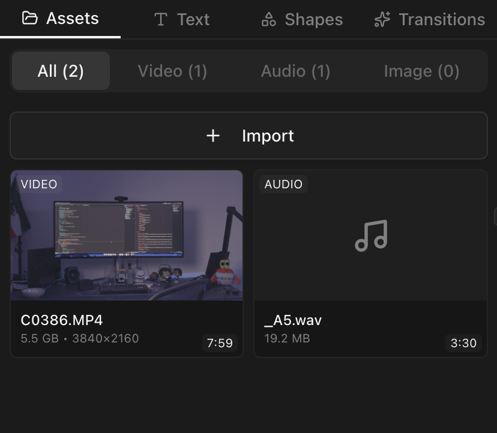
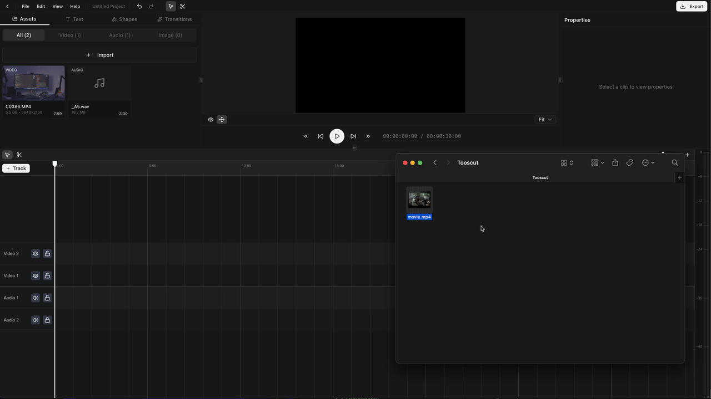
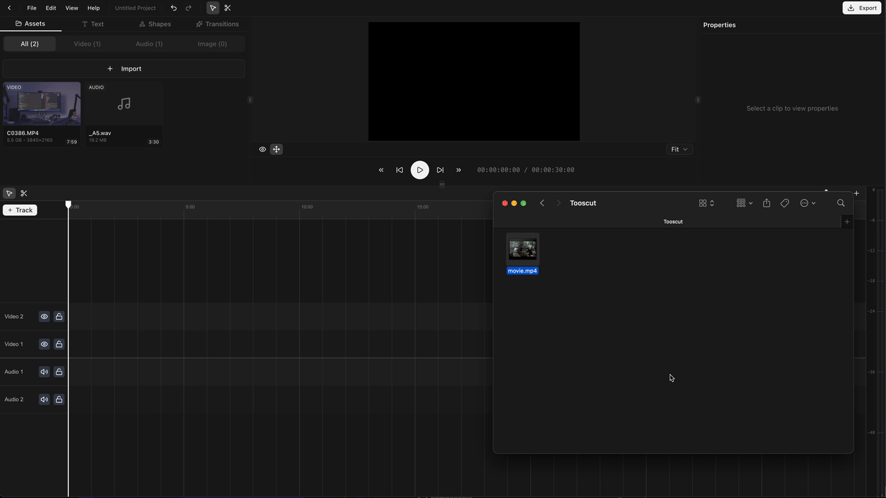

## Import with the file picker

<kbd>⌘I</kbd> or **File > Import Media** opens the system file picker. Select one or more files. They read directly from disk via the File System Access API — nothing is uploaded.

## Drag and drop

Drag files from your file manager into the Tooscut window. They appear in the asset panel.

## Supported file types

| Type      | Formats                                             |
| --------- | --------------------------------------------------- |
| **Video** | MP4, WebM, MOV, and other browser-supported formats |
| **Audio** | MP3, WAV, AAC, OGG                                  |
| **Image** | PNG, JPEG, WebP, GIF                                |
| **LUT**   | `.cube` files (3D look-up tables, up to 64³)        |

## The asset panel

Imported assets show up in the asset panel on the left. Each entry displays a thumbnail, duration (in frames), dimensions, file name, and type.

## Adding assets to the timeline

Drag an asset from the panel onto a timeline track to create a clip.

Or drag directly from your file explorer onto the timeline.

Video files with audio create a linked pair (video clip + audio clip) that move and edit together. See [Multi-Track Editing](/docs/advanced/multi-track-editing) for details.

## LUT files

`.cube` LUT files import like any other asset. Reference them from a LUT node in the [color grading graph](/docs/color-grading/curves-and-luts).
