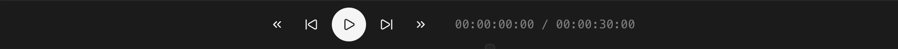

## Play and pause

<kbd>Space</kbd> toggles playback. The preview panel shows the current playhead frame.

## Navigation

| Key             | Action         |
| --------------- | -------------- |
| <kbd>→</kbd>    | Next frame     |
| <kbd>←</kbd>    | Previous frame |
| <kbd>Home</kbd> | Jump to start  |
| <kbd>End</kbd>  | Jump to end    |

## Scrubbing

Click the timeline ruler to jump the playhead. Click and drag to scrub.

## Playback speed

Adjust speed (including slow motion and reverse) from the playback controls in the toolbar.
