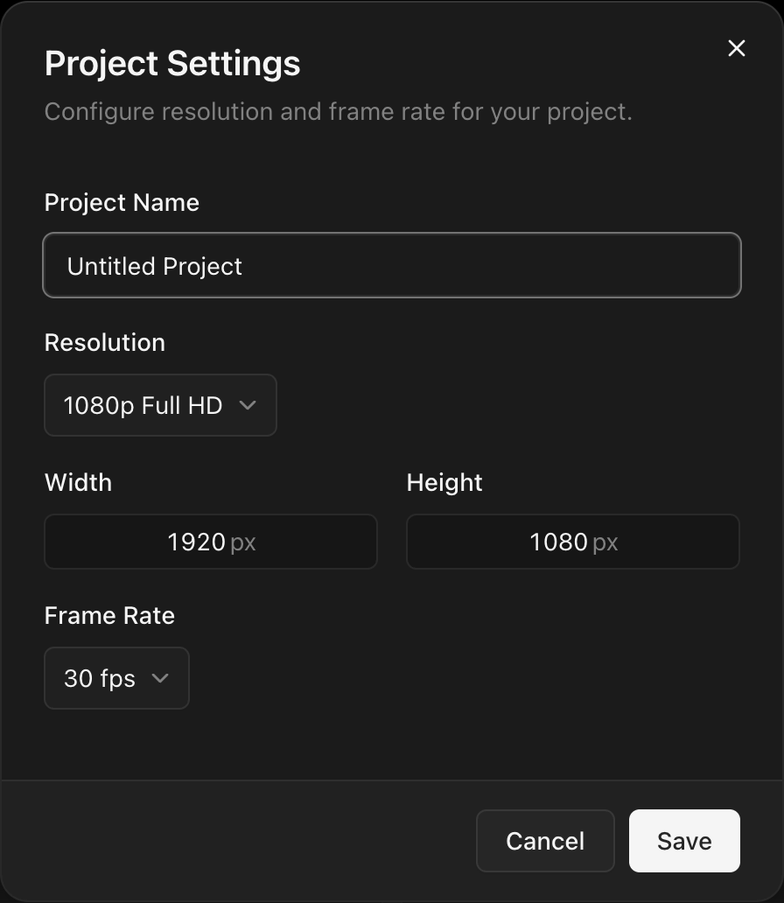

## Resolution

Built-in presets or custom width/height.

### Landscape presets

| Preset        | Resolution  |
| ------------- | ----------- |
| 4K UHD        | 3840 × 2160 |
| 1080p Full HD | 1920 × 1080 |
| 720p HD       | 1280 × 720  |

### Portrait presets

| Preset        | Resolution  |
| ------------- | ----------- |
| Portrait 1080 | 1080 × 1920 |
| Portrait 720  | 720 × 1280  |

### Square

| Preset | Resolution  |
| ------ | ----------- |
| Square | 1080 × 1080 |

### Platform presets

| Preset         | Resolution  |
| -------------- | ----------- |
| YouTube        | 1920 × 1080 |
| YouTube Short  | 1080 × 1920 |
| Instagram Reel | 1080 × 1920 |
| Instagram Post | 1080 × 1080 |
| TikTok         | 1080 × 1920 |

## Frame rate

| Rate       | Use case            |
| ---------- | ------------------- |
| **24 fps** | Film                |
| **25 fps** | PAL broadcast       |
| **29.97**  | NTSC broadcast      |
| **30 fps** | Web video           |
| **59.94**  | NTSC high framerate |
| **60 fps** | Smooth motion       |

Applies to the timeline grid, playback, and export. Changing frame rate does not re-time existing clips.

## Project name

Shown in the project list. Change it anytime.
