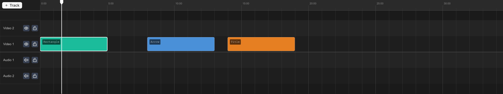

## Splitting

1. Move the playhead to the cut point.
2. Select the clip.
3. Press <kbd>S</kbd>.

Both halves keep all properties (effects, keyframes, color grading). Linked clips split together.

## Trimming

Drag the left or right edge of a clip to adjust its boundary. Non-destructive — drag back out to restore trimmed material.

- **Left edge right** — Reveals a later portion of the source.
- **Right edge left** — Shortens from the end.

## Select tool vs. razor tool

| Tool       | Shortcut     | Behavior                                                     |
| ---------- | ------------ | ------------------------------------------------------------ |
| **Select** | <kbd>V</kbd> | Click to select clips, drag to move them, drag edges to trim |
| **Razor**  | <kbd>C</kbd> | Click on any clip to split it at that point                  |

The razor tool splits without selecting first — just click where to cut.

## Deleting clips

Select clips and press <kbd>Delete</kbd> or <kbd>Backspace</kbd>. Linked clips are deleted together.

## Ripple editing

Press <kbd>R</kbd> or click the ripple icon in the timeline toolbar to toggle **ripple mode**.

When ripple mode is on:

- **Deleting** a clip shifts every clip after it on the same track left to close the gap.
- **Trimming** a clip's edge shifts downstream clips to match, so no gap opens or closes.
- Linked clips (audio + video pairs) ripple together. Other tracks are unaffected, and locked tracks never shift.

While dragging a ripple trim, ghost outlines preview where downstream clips will land. Turn ripple mode off to go back to normal trimming, which leaves gaps.
