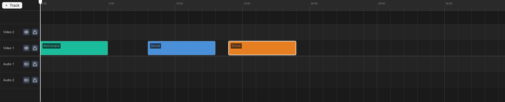

## Layout

- **Ruler** — Time markers across the top. Click to move the playhead.
- **Track headers** — Track names, mute, and lock controls on the left.
- **Clip area** — Clips as colored blocks.
- **Playhead** — Vertical line at the current time.

## Tracks

- **Video tracks** — Hold video, image, text, and shape clips. Higher tracks render on top.
- **Audio tracks** — Hold audio clips. Each video track has a paired audio track.

Tracks are always created in pairs (video + audio). See [Multi-Track Editing](/docs/advanced/multi-track-editing) for more.

## Clips

Each clip has a **start time**, **duration**, and **in point** (where playback begins within the source media). Video clips show thumbnails; audio clips show waveforms.

## Selecting clips

- **Click** to select. **Shift-click** to toggle.
- <kbd>⌘A</kbd> — Select all.
- <kbd>Escape</kbd> — Deselect all.

## Moving clips

Drag left/right to reposition in time. Drag up/down to change tracks. Clips snap to the playhead and other clip edges.

## Zoom and scroll

- <kbd>⌘+</kbd> / <kbd>⌘-</kbd> — Zoom in/out.
- Scroll horizontally to move through time.
- Scroll vertically to see more tracks.
