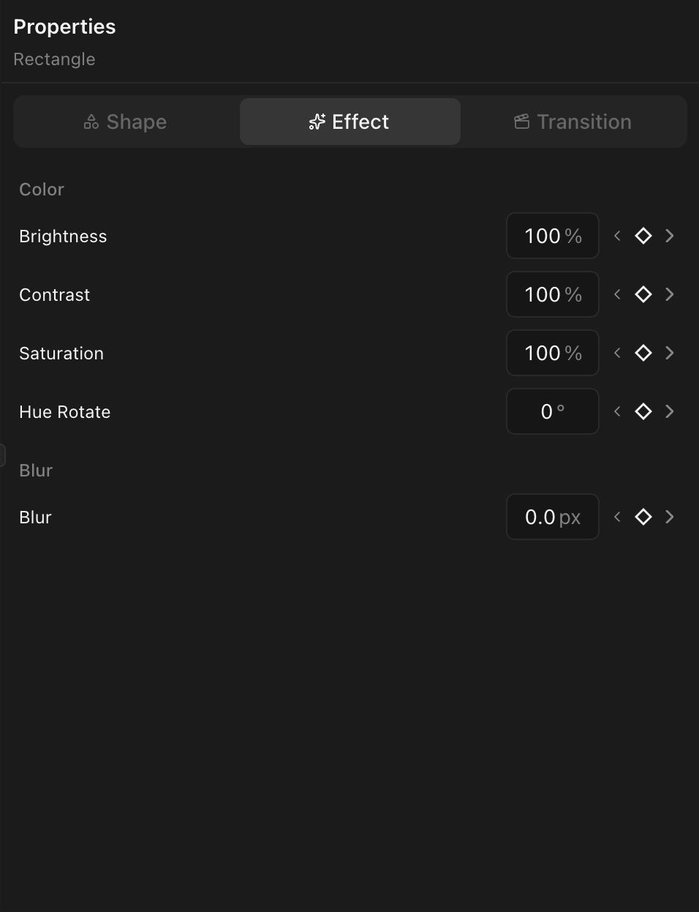

Per-clip adjustments on any visual clip type (video, image, text, shape). GPU-composited and keyframeable.

Select a visual clip and open the **Effects** tab in the properties panel.

## Available effects

### Brightness

- **Range:** 0% to 300% (default 100%)
- Below 100% darkens, above 100% brightens.

### Contrast

- **Range:** 0% to 300% (default 100%)
- Lower = flatter image, higher = more dynamic range.

### Saturation

- **Range:** 0% to 300% (default 100%)
- 0% = grayscale. Above 100% = more vivid.

### Hue Rotate

- **Range:** 0 to 360 degrees (default 0)
- Shifts all colors around the color wheel.

### Blur

- **Range:** 0 px+ (default 0)
- Gaussian blur. Good for background defocus.

## Keyframing effects

All effect properties support [keyframes](/docs/animation/keyframing). Example: animate blur from 0 to 20 over 0.5s for a focus-pull.

## Effects vs. color grading

These are basic global adjustments. For per-channel curves, LUTs, color isolation, or regional masking, use [color grading](/docs/color-grading/color-grading-overview). Both work on the same clip.
