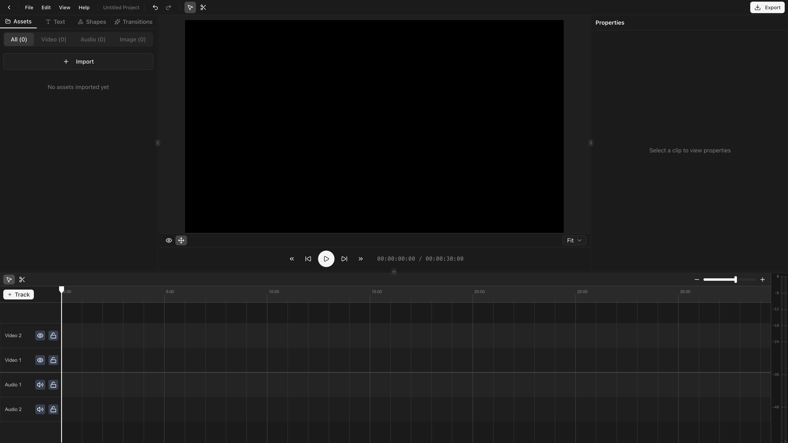
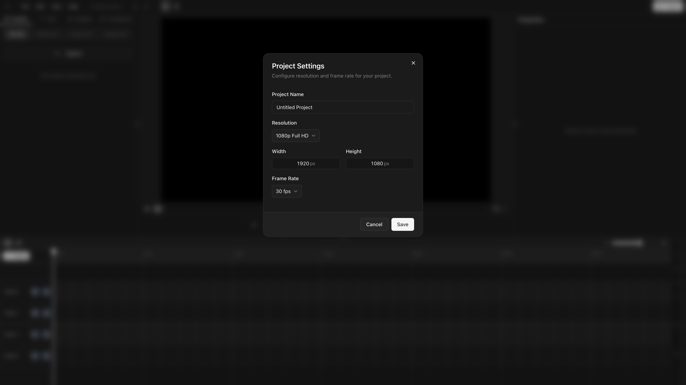

## Create a project

Click **New project**. Pick a name, resolution, and frame rate (changeable later in [Project Settings](/docs/basics/project-settings)).

## Import media

<kbd>⌘I</kbd> opens the file picker. Select video, audio, or image files. Files stay on your machine
(File System Access API, no upload).

## Add clips to the timeline

Drag an asset from the asset panel onto the timeline. Video files create a linked pair (video + audio clip) that move and split together.

## Make your first cut

1. Position the playhead at the cut point.
2. Select the clip.
3. Press <kbd>S</kbd> to split.
4. Select the unwanted half, press <kbd>Delete</kbd>.

## Preview

<kbd>Space</kbd> to play. Arrow keys to step frame-by-frame.

## Export

<kbd>⌘E</kbd> to open the export dialog. Pick a quality preset and click **Export**. Uses WebCodecs
with WASM fallback. See [Exporting](/docs/basics/exporting) for details.

## Next steps

<Cards>
  <Card title="Importing Assets" href="/docs/basics/importing-assets" />
  <Card title="Timeline Overview" href="/docs/basics/timeline-overview" />
  <Card title="Keyboard Shortcuts" href="/docs/advanced/keyboard-shortcuts" />
</Cards>
