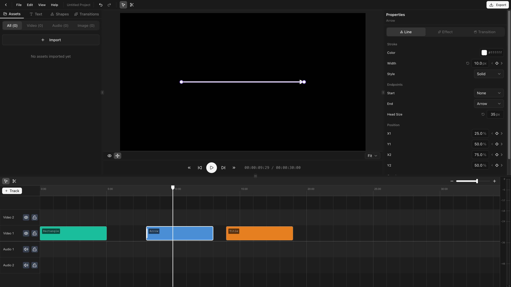
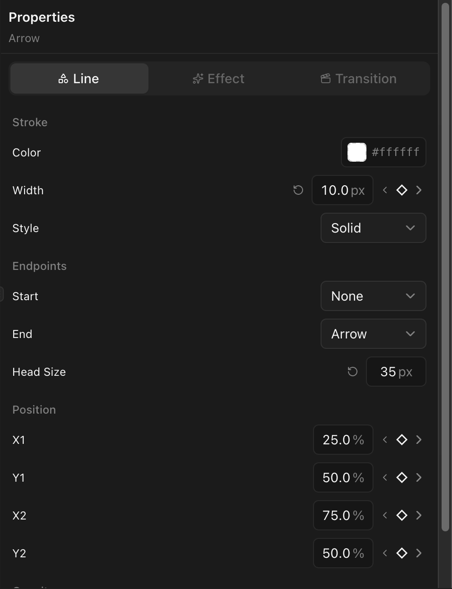

## Line vs. arrow

Two templates in the shape panel:

- **Line** — Plain line segment.
- **Arrow** — Line with an arrowhead at one end.

Drag either onto a video track to create a clip.

## Line properties

| Property         | Description              |
| ---------------- | ------------------------ |
| **Color**        | Line stroke color (RGBA) |
| **Stroke width** | Thickness in pixels      |
| **Stroke style** | Solid, Dashed, or Dotted |

## Endpoint types

Each end has an independent style:

| Endpoint    | Description      |
| ----------- | ---------------- |
| **None**    | No decoration    |
| **Arrow**   | An arrowhead     |
| **Circle**  | A filled circle  |
| **Square**  | A filled square  |
| **Diamond** | A filled diamond |

## Position

Lines are positioned by bounding box (x, y, width, height), drawn corner-to-corner. Reposition by dragging on the canvas or editing values in the properties panel.

## Animation

Position, stroke width, and endpoints all support [keyframes](/docs/animation/keyframing).
