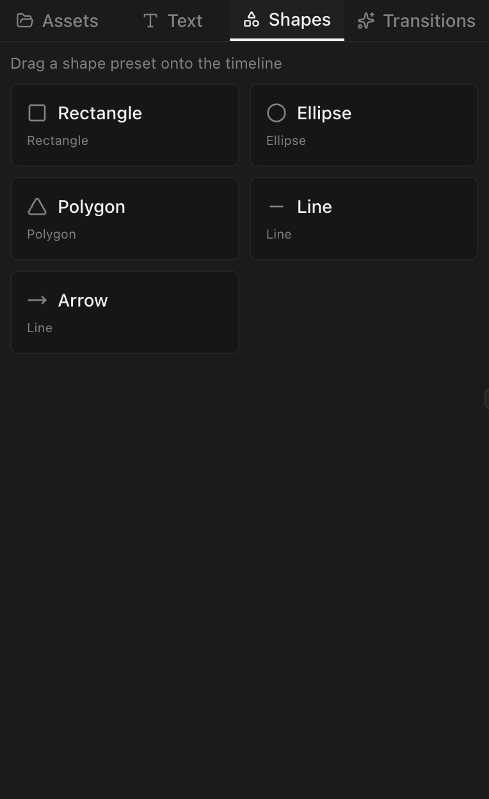
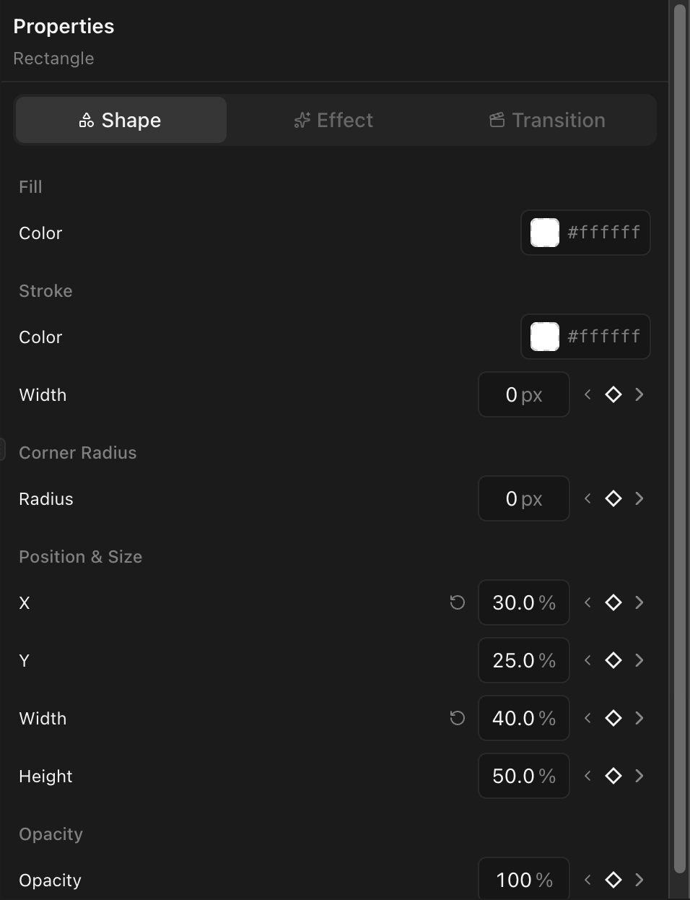

## Available shapes

| Shape         | Description                                           |
| ------------- | ----------------------------------------------------- |
| **Rectangle** | A box with optional rounded corners                   |
| **Ellipse**   | A circle or oval                                      |
| **Polygon**   | A regular polygon — defaults to 6 sides, configurable |

## Create a shape clip

Drag a shape from the panel onto a video track. Default duration: 5 seconds.

## Shape properties

Select a shape clip to configure:

| Property          | Description                                             |
| ----------------- | ------------------------------------------------------- |
| **Fill color**    | The shape's fill (RGBA color picker)                    |
| **Stroke color**  | Optional outline color                                  |
| **Stroke width**  | Outline thickness in pixels                             |
| **Corner radius** | Round the corners (rectangles only)                     |
| **Sides**         | Number of sides (polygons only, e.g., 3 for a triangle) |

## Position and size

Set position (x, y) and dimensions (width, height) in the transform section or drag on the preview canvas.

## Animation

All shape properties — fill color, stroke width, corner radius, position — support [keyframes](/docs/animation/keyframing).
