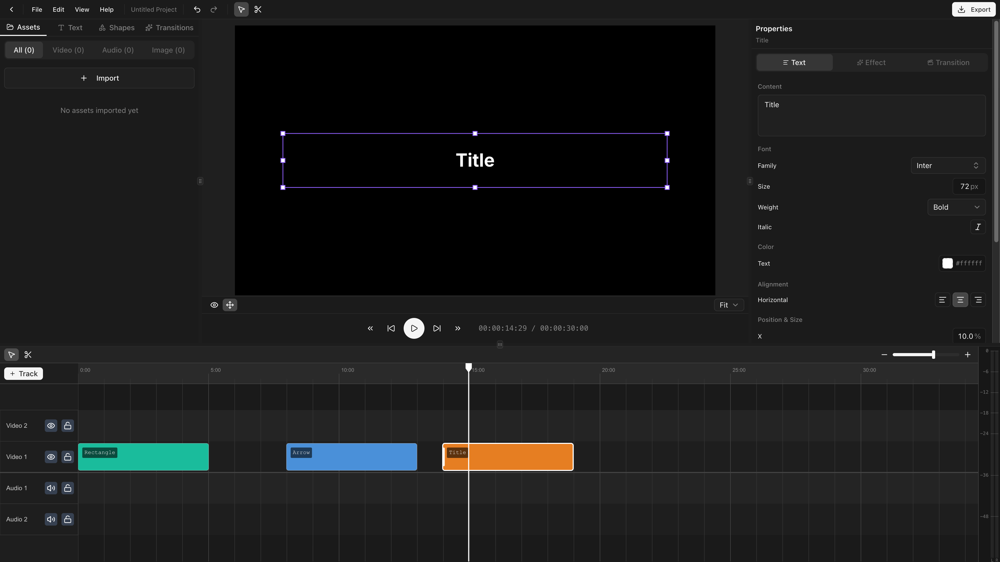

## Create a text clip

Drag a text template from the text panel onto a video track. Default duration: 5 seconds.

## Edit text content

Select the clip and edit the text content in the properties panel.

## Font selection

The font picker uses Google Fonts. Search by name, pick a weight (Regular, Medium, Bold, etc.), and toggle italic if available.

## Text styling

| Property           | Description                |
| ------------------ | -------------------------- |
| **Font size**      | Size in pixels             |
| **Color**          | Text fill color (RGBA)     |
| **Opacity**        | Overall text opacity       |
| **Alignment**      | Left, center, or right     |
| **Line height**    | Spacing between lines      |
| **Letter spacing** | Spacing between characters |

## Text background

- **Background color** — Fill color behind the text.
- **Background padding** — Spacing between text and background edge.
- **Background border radius** — Round the background corners.

## Position and size

Set position (x, y) and dimensions (width, height) via the transform controls or by dragging on the preview canvas. All transform properties support [keyframes](/docs/animation/keyframing).
